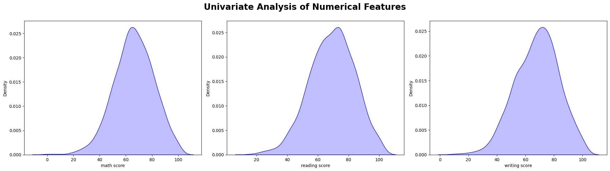
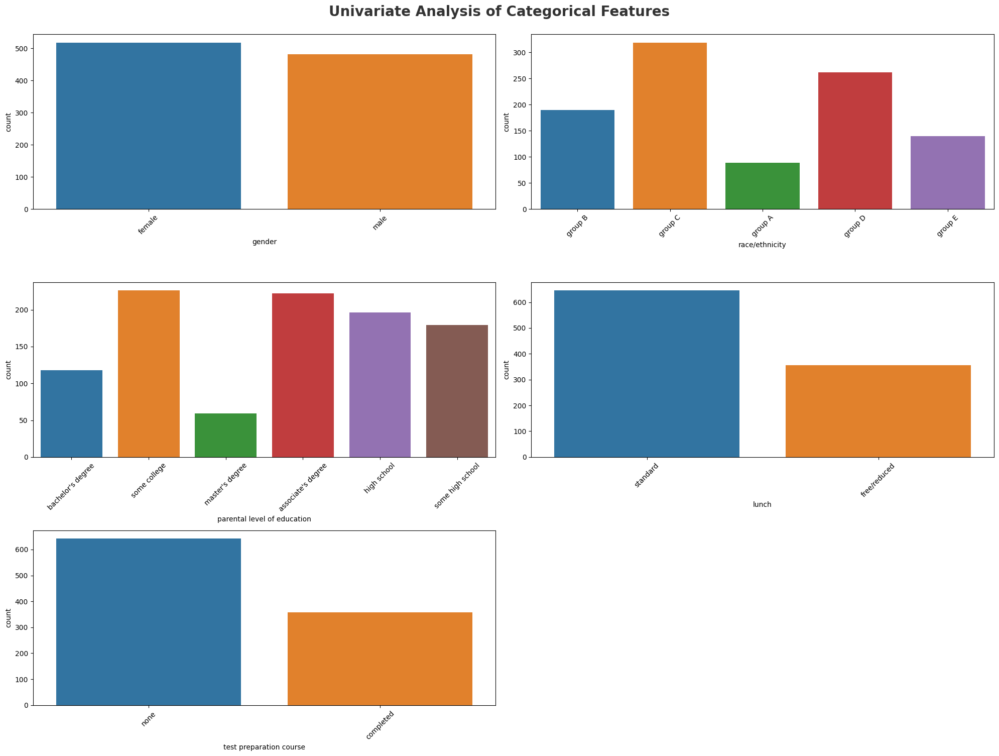
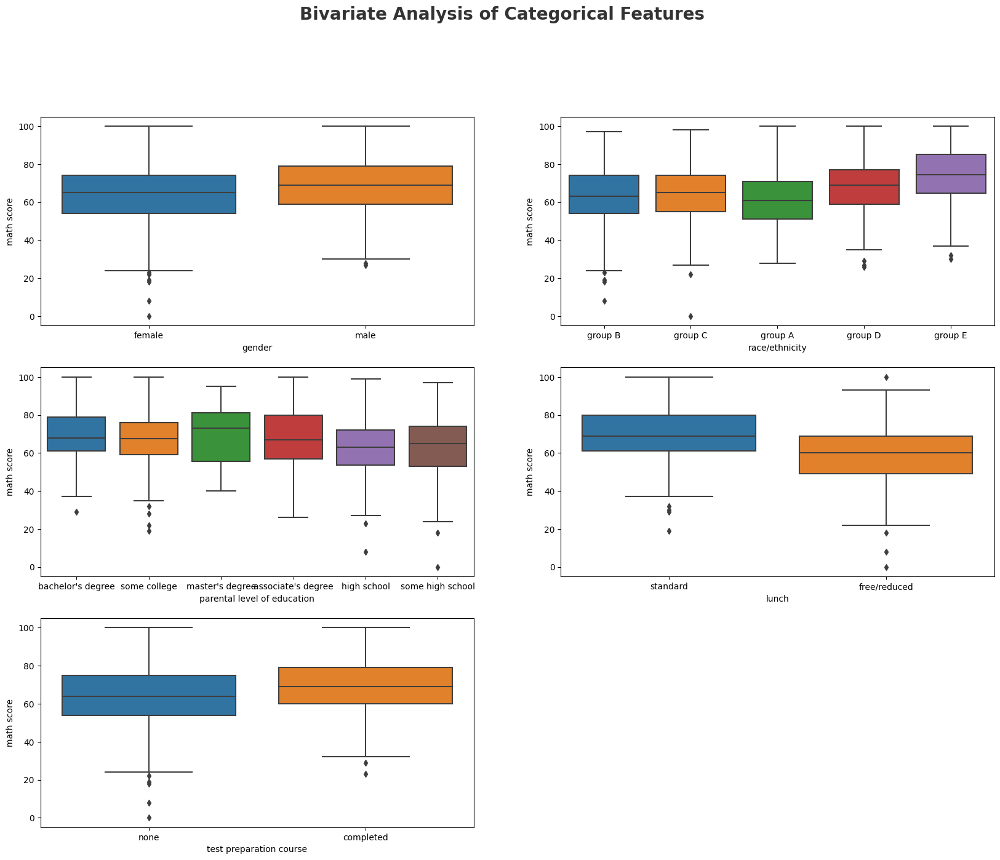
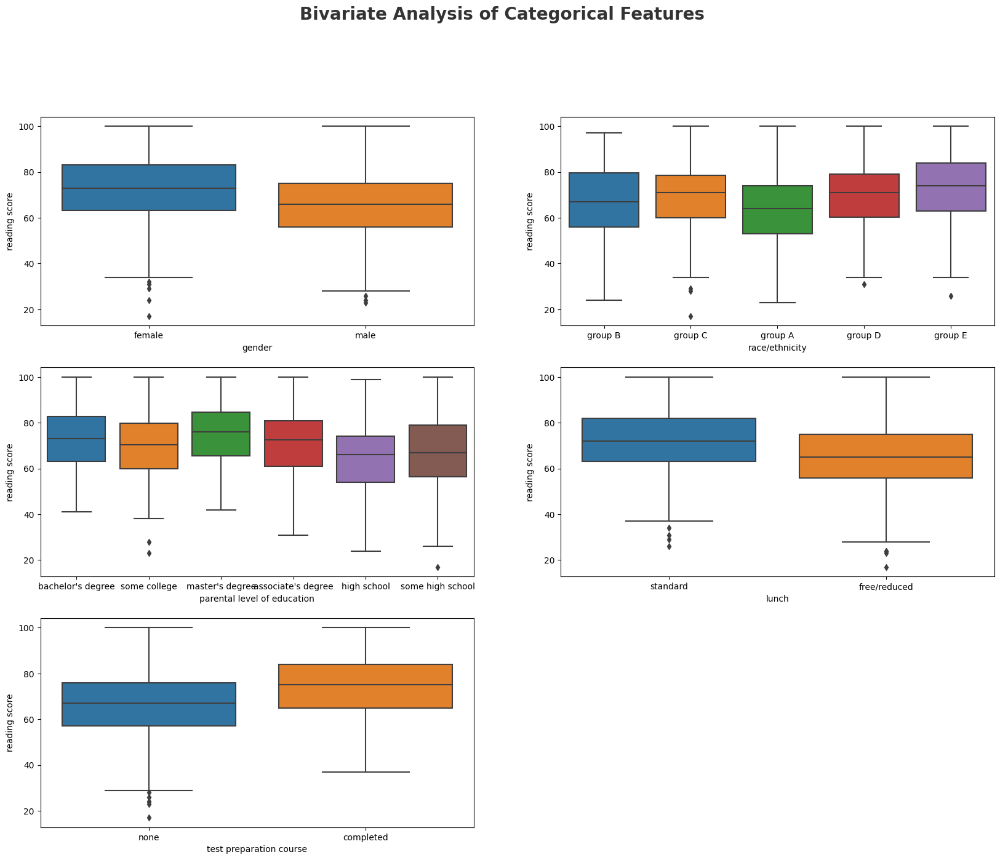
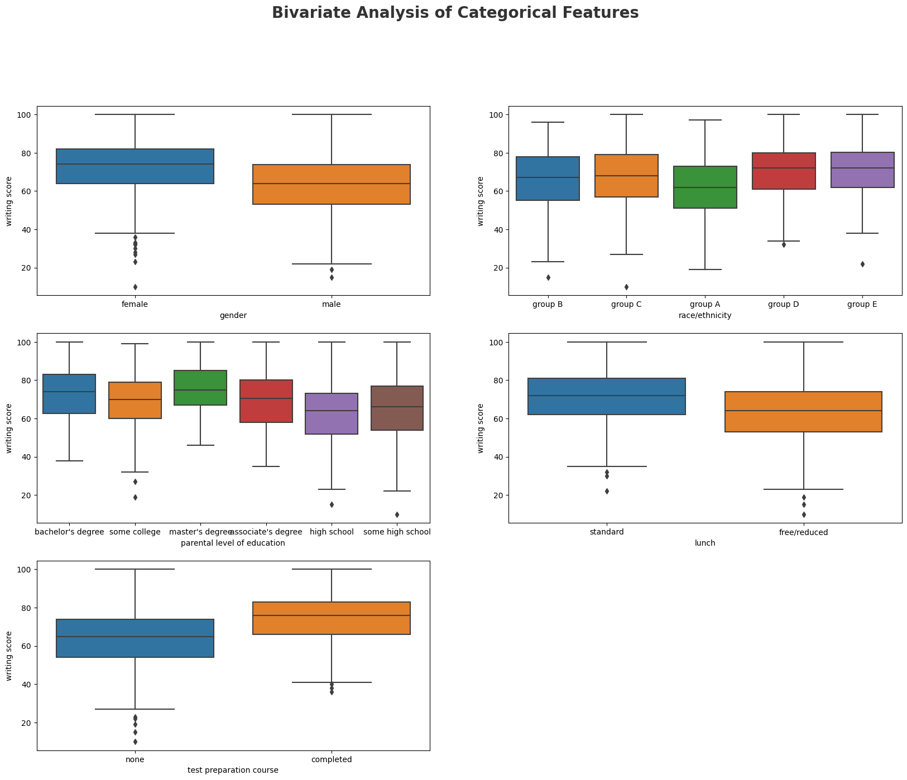
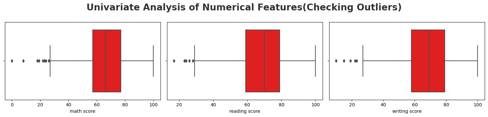
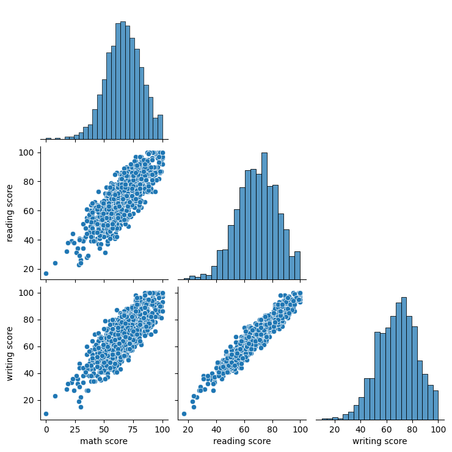
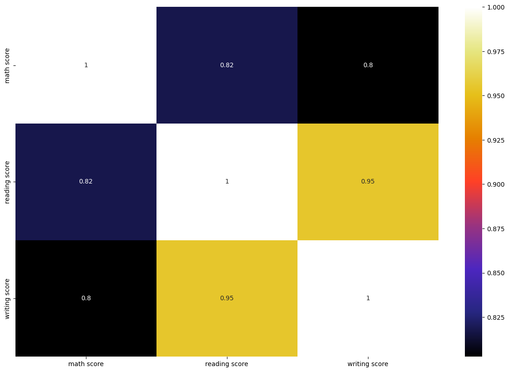

### Shreyas Kumbhar

## 1) Problem statement
Analysis on the Student’s Performance dataset to learn and explore the reasons which affect the marks scored by students.

## 2) Data Collection.
The Dataset is collected from https://www.kaggle.com/datasets/spscientist/students-performance-in-exams  
The data consists of 8 column and 1000 rows.

## 3) Attribute infomation
1. We see that most of the variables are Categorical.
2. I am not very sure why would ‘lunch’ affect the scores.
3. I think Parent's education level does affect the student's performance to some extent.
4. Columns: gender, race/ethnicity, parental level of education, lunch, test preparation course, math score, reading score, writing score.


```python
import pandas as pd
import matplotlib.pyplot as plt
import seaborn as sns
import numpy as np
import warnings
warnings.filterwarnings('ignore')
```


```python
df = pd.read_csv("F:\Dataset\StudentsPerformance.csv")
```


```python
df.head()
```


<div>
<style scoped>
    .dataframe tbody tr th:only-of-type {
        vertical-align: middle;
    }

    .dataframe tbody tr th {
        vertical-align: top;
    }

    .dataframe thead th {
        text-align: right;
    }
</style>
<table border="1" class="dataframe">
  <thead>
    <tr style="text-align: right;">
      <th></th>
      <th>gender</th>
      <th>race/ethnicity</th>
      <th>parental level of education</th>
      <th>lunch</th>
      <th>test preparation course</th>
      <th>math score</th>
      <th>reading score</th>
      <th>writing score</th>
    </tr>
  </thead>
  <tbody>
    <tr>
      <th>0</th>
      <td>female</td>
      <td>group B</td>
      <td>bachelor's degree</td>
      <td>standard</td>
      <td>none</td>
      <td>72</td>
      <td>72</td>
      <td>74</td>
    </tr>
    <tr>
      <th>1</th>
      <td>female</td>
      <td>group C</td>
      <td>some college</td>
      <td>standard</td>
      <td>completed</td>
      <td>69</td>
      <td>90</td>
      <td>88</td>
    </tr>
    <tr>
      <th>2</th>
      <td>female</td>
      <td>group B</td>
      <td>master's degree</td>
      <td>standard</td>
      <td>none</td>
      <td>90</td>
      <td>95</td>
      <td>93</td>
    </tr>
    <tr>
      <th>3</th>
      <td>male</td>
      <td>group A</td>
      <td>associate's degree</td>
      <td>free/reduced</td>
      <td>none</td>
      <td>47</td>
      <td>57</td>
      <td>44</td>
    </tr>
    <tr>
      <th>4</th>
      <td>male</td>
      <td>group C</td>
      <td>some college</td>
      <td>standard</td>
      <td>none</td>
      <td>76</td>
      <td>78</td>
      <td>75</td>
    </tr>
  </tbody>
</table>
</div>


```python
df.tail()
```


<div>
<style scoped>
    .dataframe tbody tr th:only-of-type {
        vertical-align: middle;
    }

    .dataframe tbody tr th {
        vertical-align: top;
    }

    .dataframe thead th {
        text-align: right;
    }
</style>
<table border="1" class="dataframe">
  <thead>
    <tr style="text-align: right;">
      <th></th>
      <th>gender</th>
      <th>race/ethnicity</th>
      <th>parental level of education</th>
      <th>lunch</th>
      <th>test preparation course</th>
      <th>math score</th>
      <th>reading score</th>
      <th>writing score</th>
    </tr>
  </thead>
  <tbody>
    <tr>
      <th>995</th>
      <td>female</td>
      <td>group E</td>
      <td>master's degree</td>
      <td>standard</td>
      <td>completed</td>
      <td>88</td>
      <td>99</td>
      <td>95</td>
    </tr>
    <tr>
      <th>996</th>
      <td>male</td>
      <td>group C</td>
      <td>high school</td>
      <td>free/reduced</td>
      <td>none</td>
      <td>62</td>
      <td>55</td>
      <td>55</td>
    </tr>
    <tr>
      <th>997</th>
      <td>female</td>
      <td>group C</td>
      <td>high school</td>
      <td>free/reduced</td>
      <td>completed</td>
      <td>59</td>
      <td>71</td>
      <td>65</td>
    </tr>
    <tr>
      <th>998</th>
      <td>female</td>
      <td>group D</td>
      <td>some college</td>
      <td>standard</td>
      <td>completed</td>
      <td>68</td>
      <td>78</td>
      <td>77</td>
    </tr>
    <tr>
      <th>999</th>
      <td>female</td>
      <td>group D</td>
      <td>some college</td>
      <td>free/reduced</td>
      <td>none</td>
      <td>77</td>
      <td>86</td>
      <td>86</td>
    </tr>
  </tbody>
</table>
</div>


#### Observation:

1. We see that most of the variables are Categorical.
2. I am not very sure why would ‘lunch’ affect the scores.
3. I think Parent's education level does affect the student's performance to some extent.
4. Columns: gender, race/ethnicity, parental level of education, lunch, test preparation course, math score, reading score, writing score.


```python
df.shape
```


    (1000, 8)


```python
df.columns
```


    Index(['gender', 'race/ethnicity', 'parental level of education', 'lunch',
           'test preparation course', 'math score', 'reading score',
           'writing score'],
          dtype='object')


```python
df.info()
```

    <class 'pandas.core.frame.DataFrame'>
    RangeIndex: 1000 entries, 0 to 999
    Data columns (total 8 columns):
     #   Column                       Non-Null Count  Dtype 
    ---  ------                       --------------  ----- 
     0   gender                       1000 non-null   object
     1   race/ethnicity               1000 non-null   object
     2   parental level of education  1000 non-null   object
     3   lunch                        1000 non-null   object
     4   test preparation course      1000 non-null   object
     5   math score                   1000 non-null   int64 
     6   reading score                1000 non-null   int64 
     7   writing score                1000 non-null   int64 
    dtypes: int64(3), object(5)
    memory usage: 62.6+ KB
    


```python
df.dtypes
```


    gender                         object
    race/ethnicity                 object
    parental level of education    object
    lunch                          object
    test preparation course        object
    math score                      int64
    reading score                   int64
    writing score                   int64
    dtype: object


```python
# numeric column 
numeric_features = [feature for feature in df.columns if df[feature].dtypes != 'O']
numeric_features
```


    ['math score', 'reading score', 'writing score']


```python
# categorical column
categorical_features = [feature for feature in df.columns if df[feature].dtypes == 'O']
categorical_features
```


    ['gender',
     'race/ethnicity',
     'parental level of education',
     'lunch',
     'test preparation course']


```python
df.memory_usage()
```


    Index                           128
    gender                         8000
    race/ethnicity                 8000
    parental level of education    8000
    lunch                          8000
    test preparation course        8000
    math score                     8000
    reading score                  8000
    writing score                  8000
    dtype: int64


```python
df.isnull().sum()
```


    gender                         0
    race/ethnicity                 0
    parental level of education    0
    lunch                          0
    test preparation course        0
    math score                     0
    reading score                  0
    writing score                  0
    dtype: int64


```python
df.duplicated().sum()
```


    0


```python
df.describe().T
```


<div>
<style scoped>
    .dataframe tbody tr th:only-of-type {
        vertical-align: middle;
    }

    .dataframe tbody tr th {
        vertical-align: top;
    }

    .dataframe thead th {
        text-align: right;
    }
</style>
<table border="1" class="dataframe">
  <thead>
    <tr style="text-align: right;">
      <th></th>
      <th>count</th>
      <th>mean</th>
      <th>std</th>
      <th>min</th>
      <th>25%</th>
      <th>50%</th>
      <th>75%</th>
      <th>max</th>
    </tr>
  </thead>
  <tbody>
    <tr>
      <th>math score</th>
      <td>1000.0</td>
      <td>66.089</td>
      <td>15.163080</td>
      <td>0.0</td>
      <td>57.00</td>
      <td>66.0</td>
      <td>77.0</td>
      <td>100.0</td>
    </tr>
    <tr>
      <th>reading score</th>
      <td>1000.0</td>
      <td>69.169</td>
      <td>14.600192</td>
      <td>17.0</td>
      <td>59.00</td>
      <td>70.0</td>
      <td>79.0</td>
      <td>100.0</td>
    </tr>
    <tr>
      <th>writing score</th>
      <td>1000.0</td>
      <td>68.054</td>
      <td>15.195657</td>
      <td>10.0</td>
      <td>57.75</td>
      <td>69.0</td>
      <td>79.0</td>
      <td>100.0</td>
    </tr>
  </tbody>
</table>
</div>


#### Summary:

1. We have only three columns with numerical data.
2. The average score for all three subjects is between 65–70
3. Most of the students have done better in reading score
4. There are students who have scored ZERO in Mathematics.
5. In each subject, we see that the highest mark obtained is 100.
6. It seems that mathematics is not so favorite subject among these students.


```python
df.skew()
```


    math score      -0.278935
    reading score   -0.259105
    writing score   -0.289444
    dtype: float64


```python
# If skewness is less than 1 or greater than +1, the distribution is highly skewed.
# If skewness is between 1 and  ½ or between +½ and +1, the distribution is moderately skewed.
# If skewness is between  ½ and +½, the distribution is approximately symmetric.
```


```python
df.kurtosis()
# A normal distribution has kurtosis exactly 3 (excess kurtosis exactly 0). Any distribution with kurtosis ≈3
# (excess ≈0) is called mesokurtic.
# A distribution with kurtosis <3 (excess kurtosis <0 ) is called platykurtic. Compared to a normal distribution,
# its tails are shorter and thinner, and often its central peak is lower and broader.
# A distribution with kurtosis >3 (excess kurtosis >0) is called leptokurtic. Compared to a normal distribution,
# its tails are longer and fatter, and often its central peak is higher and sharper.
```


    math score       0.274964
    reading score   -0.068265
    writing score   -0.033365
    dtype: float64


```python

```

## Univariate Analysis
The term univariate analysis refers to the analysis of one variable prefix “uni” means “one.” The purpose of univariate analysis is to understand the distribution of values for a single variable.


```python
#Univariate Analysis

fig = plt.figure(figsize = (20,15))
plt.suptitle('Univariate Analysis of Numerical Features',fontsize=20,fontweight='bold',y=1.)
for i in enumerate(numeric_features):
    plt.subplot(3,3,i[0]+1)
    sns.kdeplot(x=df[numeric_features[i[0]]],shade='True',color='b')
    plt.xlabel(numeric_features[i[0]])
    plt.tight_layout()
```


    

    


### report
1. math score, reading score, writing score are follows normal distrubution but slightly left-skewed .
2. Data is normally distributed.
3. We try to bring the data to normal by applying different techniques.


```python
# categorical columns
plt.figure(figsize=(20, 15))
plt.suptitle('Univariate Analysis of Categorical Features', fontsize=20, fontweight='bold', alpha=0.8, y=1.)
for i in range(0, len(categorical_features)):
    plt.subplot(3, 2, i+1)
    sns.countplot(x=df[categorical_features[i]])
    plt.xlabel(categorical_features[i])
    plt.xticks(rotation=45)
    plt.tight_layout()
```


    

    


## Bivariate Analysis of Categorical Features vs math score


```python
# categorical columns
plt.figure(figsize=(20, 15))
plt.suptitle('Bivariate Analysis of Categorical Features', fontsize=20, fontweight='bold', alpha=0.8, y=1.)
for i in range(0, len(categorical_features)):
    plt.subplot(3, 2, i+1)
    sns.boxplot(x= df[categorical_features[i]], y= df[numeric_features[0]], data=df)
    plt.xlabel(categorical_features[i])

```


    

    


#### Observation regarding the Math Scores vs Categorical Features plots:

1. In Math, on average, Male students have scored more than Female students. And one student that scored zero in Maths is a Female.
2. In Math, group E has performed the best and group A the worst. The student who scored zero belongs to group C.
3. For all the three subjects, the students who have scored the highest belonging to the parents with Masters Degree.
4. It is clear that all the students who completed the course have scored better marks on an average than those who did not complete.

## Bivariate Analysis of Categorical Features vs reading score


```python
# categorical columns
plt.figure(figsize=(20, 15))
plt.suptitle('Bivariate Analysis of Categorical Features', fontsize=20, fontweight='bold', alpha=0.8, y=1.)
for i in range(0, len(categorical_features)):
    plt.subplot(3, 2, i+1)
    sns.boxplot(x= df[categorical_features[i]], y= df[numeric_features[1]], data=df)
    plt.xlabel(categorical_features[i]) 
```


    

    


#### Observation regarding the Reading Scores vs Categorical Features plots:
1. In Reading, female students have done better than male students. Also, the student that scored the lowest marks is a female.
2. In Reading, group E has performed the best and group A the worst. The student who scored the lowest marks belongs to group C.
3. Students whose parents have a bachelor’s degree have also consistently performed well.
4. The students who did not complete the course are the ones who scored zero and the lowest marks.

## Bivariate Analysis of Categorical Features vs writing score


```python
# categorical columns
plt.figure(figsize=(20, 15))
plt.suptitle('Bivariate Analysis of Categorical Features', fontsize=20, fontweight='bold', alpha=0.8, y=1.)
for i in range(0, len(categorical_features)):
    plt.subplot(3, 2, i+1)
    sns.boxplot(x= df[categorical_features[i]], y= df[numeric_features[2]], data=df)
    plt.xlabel(categorical_features[i]) 
```


    

    


#### Observation regarding the Writing Scores vs Categorical Features plots:
1. females have performed better than males and again the student that scored the lowest in this subject is also a female.
2. In Writing, groups C, D & E have done well. Group A performed the worst and the lowest marks are from group C.
3. Students whose parents have a bachelor’s degree have also consistently performed well.
4. The students who did not complete the course are the ones who scored zero and the lowest marks.


```python
plt.figure(figsize=(15, 15))
plt.suptitle('Univariate Analysis of Numerical Features(Checking Outliers)', fontsize=20, fontweight='bold', alpha=0.8, y=1.)

for i in range(0, len(numeric_features)):
    plt.subplot(5, 3, i+1)
    sns.boxplot(x=df[numeric_features[i]], color='r')
    plt.xlabel(numeric_features[i])
    plt.tight_layout()
```


    

    


#### Report
1. Outleirs present in all numeric feature.
2. Distribution is almost normal.
3. We will try to remove outliers by IQR method.


```python
sns.pairplot(df, corner=True)
```


    <seaborn.axisgrid.PairGrid at 0x243e3eaa6a0>


    

    


## Multivariate Analysis
Multivariate analysis is the analysis of more than one variable.

### Check Multicollinearity in Numerical features


```python
df[(list(df.columns)[1:])].corr()
```


<div>
<style scoped>
    .dataframe tbody tr th:only-of-type {
        vertical-align: middle;
    }

    .dataframe tbody tr th {
        vertical-align: top;
    }

    .dataframe thead th {
        text-align: right;
    }
</style>
<table border="1" class="dataframe">
  <thead>
    <tr style="text-align: right;">
      <th></th>
      <th>math score</th>
      <th>reading score</th>
      <th>writing score</th>
    </tr>
  </thead>
  <tbody>
    <tr>
      <th>math score</th>
      <td>1.000000</td>
      <td>0.817580</td>
      <td>0.802642</td>
    </tr>
    <tr>
      <th>reading score</th>
      <td>0.817580</td>
      <td>1.000000</td>
      <td>0.954598</td>
    </tr>
    <tr>
      <th>writing score</th>
      <td>0.802642</td>
      <td>0.954598</td>
      <td>1.000000</td>
    </tr>
  </tbody>
</table>
</div>


```python
plt.figure(figsize = (15,10))
sns.heatmap(df.corr(), cmap="CMRmap", annot=True)
plt.show()
```


    

    


## Final Report
The datatypes and Column names were right and there was 15411 rows and 13 columns  
There are outliers in the math score, reading score, writing score.


```python

```
